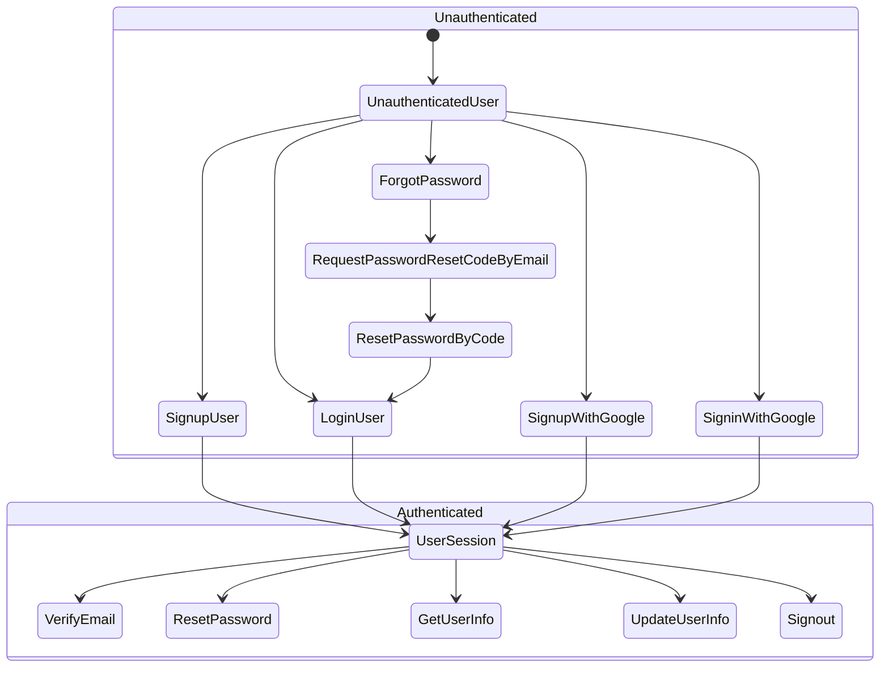

import AppNameTip from "/snippets/_app-tip.mdx"

<AppNameTip />

<Note>
Our IAM API supports two main states for a user: `Unauthenticated` and `Authenticated`. Each state allows for different authentication and user management operations.
</Note>

<Tabs>
  <Tab title="Unauthicated User State">
    When a user is unauthenticated, they can perform the following actions:

    **Login by Email and Password**

    Users can authenticate themselves by providing their email and password credentials. This flow is typically used for returning users who have already signed up.

    **Sign Up by Email and Password**

    New users can create an account by providing their email, password, and other required information (e.g., first name, last name, phone number). Upon successful sign-up, the user may be automatically logged in or required to verify their email address before gaining access.

    **Sign In with Google**

    Users can authenticate using their Google accounts, leveraging the OAuth 2.0 protocol for secure and seamless sign-in.

    **Sign Up with Google**

    New users can create an account by authenticating with their Google accounts. This flow simplifies the sign-up process by automatically retrieving user information from Google.

    **Forgot Password**

    If a user forgets their password, they can initiate the forgot password flow. This process involves the following steps:

    1. **Request Password Reset Code by Email**: The user provides their email address, and a verification code is sent to their registered email.
    2. **Verify Code and Reset Password**: The user enters the received verification code and sets a new password.
    3. **Redirect to Login by Email and Password Flow**: After successfully resetting the password, the user is redirected to the login by email and password flow to authenticate with their new credentials.

  </Tab>
  <Tab title="Authenticated User State">
    Once a user is authenticated and logged in, they can perform the following actions:

    **Verify Email**

    If the user's email was not verified during the sign-up process, they can initiate the email verification flow by requesting a verification code and confirming it.

    **Reset Password**

    Logged-in users can change their password by providing their current password and a new password.

    **Get User Information**

    Users can retrieve their user information, such as their profile details, by providing their user ID.

    **Update User Information**

    Logged-in users can update their user information, such as their profile details, by providing their user ID and the updated information.

    **Sign Out**

    Users can terminate their active session and log out of the application.

    These flows cover the essential authentication and user management operations supported by our IAM Service. Depending on your application's requirements, additional flows or customizations may be available.

  </Tab>
</Tabs>
