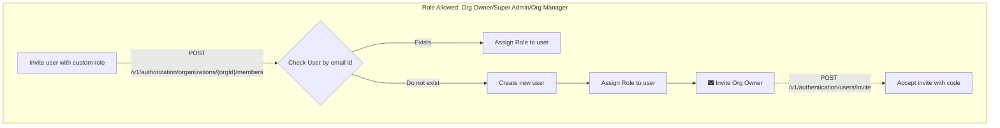

In order to invite a user with custom claim, below endpoint can be invoked, only org owners, super admin and org managers can use the below endpoint

```bash
curl --request POST \
  --url https://dev-iam.razi.ai/v1/authorization/organizations/218910290/members \
  --header 'Authorization: Bearer YOUR_SECRET_TOKEN' \
  --header 'Content-Type: application/json' \
  --header 'X-App-Name: ' \
  --data '{
  "email": "john.doe@gmail.com",
  "firstName": "John",
  "lastName": "Doe",
  "role": "admin",
  "userId": "218910290" // user id of the org owner/org manager assigning the role.
}'
```

<Tip>
[Link to Playground](https://dev-iam.razi.ai/docs#tag/authorization/POST/v1/authorization/organizations/{orgId}/members)
</Tip>

### Accept Invite for when org owner does not exist

Below endpoint can be used when user is sent the invite on email

```bash
curl --request PUT \
  --url https://dev-iam.razi.ai/v1/authentication/users/invite \
  --header 'Content-Type: application/json' \
  --header 'X-App-Name: ' \
  --data '{
  "orgId": "271296458001489512",
  "email": "john.doe@gmail.com",
  "verificationCode": "XSR89TU",
  "newPassword": "Secret@slidezAB"
}'
```

<Tip>
[Link to Playground](https://dev-iam.razi.ai/docs#tag/authentication/PUT/v1/authentication/users/invite)
</Tip>
