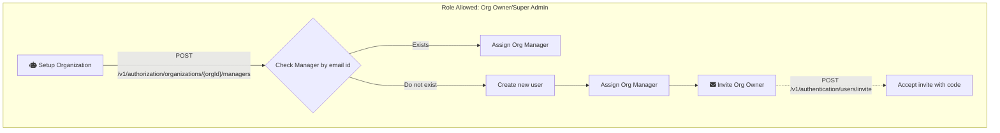

In order to invite new organization managers, below endpoint should be invoked

```bash
curl --request POST \
  --url https://dev-iam.razi.ai/v1/authorization/organizations/21892002/managers \
  --header 'Authorization: Bearer YOUR_SECRET_TOKEN' \
  --header 'Content-Type: application/json' \
  --header 'X-App-Name: ' \
  --data '{
  "email": "john.doe@gmail.com",
  "firstName": "John",
  "lastName": "Doe",
  "userId": "218910290"
}'
```

The above endpoint will check for the new organization member in system, if it exists then user will be assigned the role or Organization manager, else an invite will be sent on email along with a code which can be used to sign up.


<Tip>
[Link to Playground](https://dev-iam.razi.ai/docs#tag/authorization/POST/v1/authorization/organizations/{orgId}/managers)
</Tip>


### Accept Invite for when the invited org manager does not exist

Below endpoint can be used when org owner is sent the invite on email

```bash
curl --request PUT \
  --url https://dev-iam.razi.ai/v1/authentication/users/invite \
  --header 'Content-Type: application/json' \
  --header 'X-App-Name: ' \
  --data '{
  "orgId": "271296458001489512",
  "email": "john.doe@gmail.com",
  "verificationCode": "XSR89TU",
  "newPassword": "Secret@slidezAB"
}'
```

<Tip>
[Link to Playground](https://dev-iam.razi.ai/docs#tag/authentication/PUT/v1/authentication/users/invite)
</Tip>


