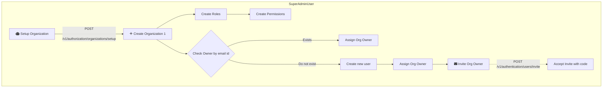

<Warning>Only superadmin can onboard new organization</Warning> 

In order to create organization, below endpoint should be invoked

```bash
curl --request POST \
  --url https://dev-iam.razi.ai/v1/authorization/organizations/setup \
  --header 'Authorization: Bearer YOUR_SECRET_TOKEN' \
  --header 'Content-Type: application/json' \
  --header 'X-App-Name: ' \
  --data '{
  "customRoles": [
    {
      "key": "admin",
      "displayName": "Admin",
      "allowedPermissions": [
        "create",
        "read",
        "update",
        "delete"
      ]
    },
    {
      "key": "reader",
      "displayName": "Reader",
      "allowedPermissions": [
        "read"
      ]
    },
    {
      "key": "writer",
      "displayName": "Writer",
      "allowedPermissions": [
        "read",
        "write"
      ]
    }
  ],
  "orgName": "Slidez",
  "adminFirstName": "John",
  "adminLastName": "Doe",
  "adminEmail": "Johndoeadmin@gmail.com"
}'
```

The above endpoint creates organization, roles and permissions, along with assignment of org owner and if org owner email do not exist then an email invite with code will be sent to the user and using the code sent in email, the org owner can sign up and invite other org managers.

<Tip>
[Link to Playground](https://dev-iam.razi.ai/docs#tag/authorization/POST/v1/authorization/organizations/setup)
</Tip>

### Accept Invite for when org owner does not exist

Below endpoint can be used when org owner is sent the invite on email

```bash
curl --request PUT \
  --url https://dev-iam.razi.ai/v1/authentication/users/invite \
  --header 'Content-Type: application/json' \
  --header 'X-App-Name: ' \
  --data '{
  "orgId": "271296458001489512",
  "email": "john.doe@gmail.com",
  "verificationCode": "XSR89TU",
  "newPassword": "Secret@slidezAB"
}'
```

<Tip>
[Link to Playground](https://dev-iam.razi.ai/docs#tag/authentication/PUT/v1/authentication/users/invite)
</Tip>