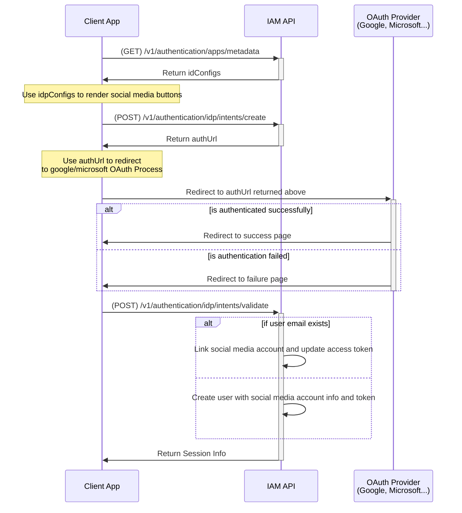

import TeamChannels from '/snippets/_team-channels.mdx';

<Check>
  IAM Service currently supports Below OAuth providers.
  - **[Google](./oauth-providers/google-idp)**
  - **[Microsoft](./oauth-providers/azure-idp)**

</Check>

<Steps>
<Step title="Enable Social Media Integration">

In order to enable social media integration for your application
we need to follow 2 steps:
1. [Register](/api-tutorials/social-media-flows/oauth-providers/google-idp) your application with IAM server, for this we need client_id and client_secret of your oauth application.
2. Whitelist callback urls of auth server in your oauth provider console.

<Note>
Step 1 is only allowed for SUPER Admin user
Reach out to our team via:

<TeamChannels />
</Note>
</Step>

<Step title="Social Media Integration in client application">

Here is a sequence diagram for the social media integration from clients

Next steps in documentation will explain how to implement the above flow in your client application.
</Step>
</Steps>