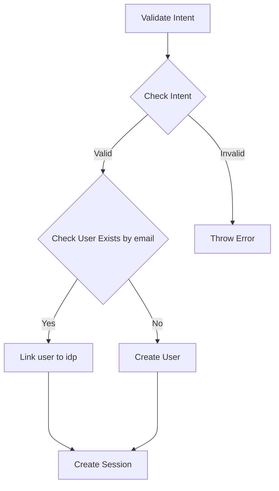

Once the OAuth flow is completed, the user will be redirected to the success or failure url.

The success url will contain 2 query parameters `intentId` and `intentToken`.

In order to validate the intent created in [previous](/api-tutorials/social-media-flows/create-intent) step, we need to call the following endpoint

```json
curl --request POST \
  --url https://dev-iam.razi.ai/v1/authentication/idp/intents/validate \
  --header 'Content-Type: application/json' \
  --header 'X-App-Name: ' \
  --data '{
  "intentId": "163840776835432705",
  "idpToken": "JtERDtsWJPHHvkb0RWT3t_xu3KQimKbPdWzgYWJd26z3Rw"
}'
```
The above API implements below flow in backend:



<Tip>
[Link to Playground](https://dev-iam.razi.ai/docs#/tag/idp-authentication/POST/v1/authentication/idp/intents/validate)
</Tip>