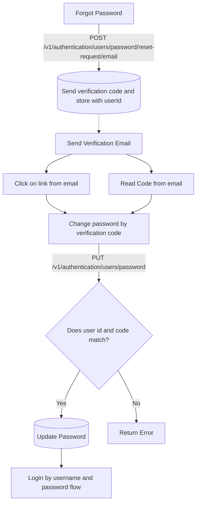

### High Level Overview


### Flow Details
If a user forgot their password, they can use the forgot password flow to reset their password.

It involves 3 step flow

1. Request a verification code and store it with the user id in the database, and an email will be sent with a link to the verification page.
2. The user can either click on the link in the email or enter the verification code along with email.
3. The above info will be sent to the server to change the password and if the code matches userId then password will be reset

In order to request the code, below endpoint can be used:

```bash
curl --request POST \
  --url https://dev-iam.razi.ai/v1/authentication/users/password/reset-request/email \
  --header 'Content-Type: application/json' \
  --header 'X-App-Name: ' \
  --data '{
  "email": "john.doe@example.com",
  "resetPasswordUrl": "http://iqraa.ai/forgot-password?code={{code}}"
}'
```
<Tip>
[Link to Playground](https://dev-iam.razi.ai/docs#tag/authentication/POST/v1/authentication/users/password/reset-request/email)

In the above example, we are using `resetPasswordUrl` to send a reset password link to the user's email.

The values `{{code}}` is placeholder that will be replaced with the a verification code when the email is sent.
</Tip>

Once user has retrived their code from email or clicked on link in email, they should enter their new password and code in the below endpoint:

```bash
curl --request PUT \
  --url https://dev-iam.razi.ai/v1/authentication/users/password \
  --header 'Content-Type: application/json' \
  --header 'X-App-Name: ' \
  --data '{
  "email": "john.doe@gmail.com",
  "verificationCode": "XSR89TU",
  "newPassword": "Secret@slidezAB"
}'
```

Depending on the mapping of userId and code, the password will be changed or an error will be returned.

<Tip>
[Link to Playground](https://dev-iam.razi.ai/docs#tag/authentication/PUT/v1/authentication/users/password)
</Tip>

