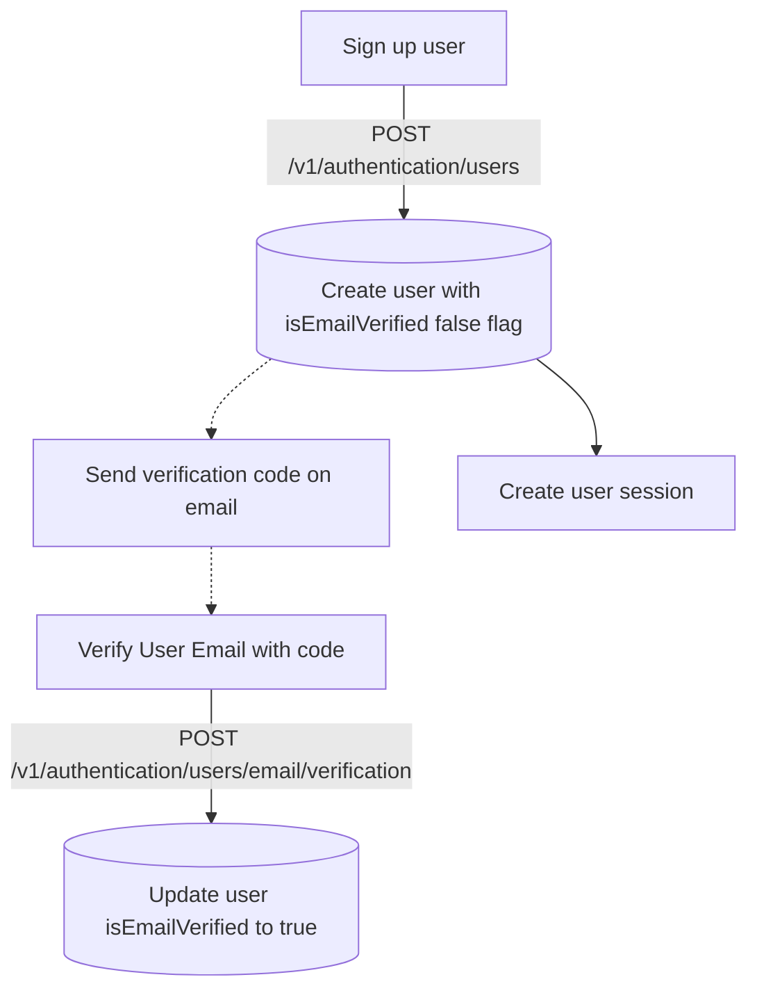

## Sign up a user
In order to sign up a user by username and password, the recommended flow is to use below endpoints


```bash
curl --request POST \
  --url https://dev-iam.razi.ai/v1/authentication/users \
  --header 'Content-Type: application/json' \
  --header 'X-App-Name: ' \
  --data '{
  "firstName": "John",
  "lastName": "Doe",
  "phoneNumber": "+971111111111",
  "metadata": {
    "key": "value"
  },
  "email": "john.doe@gmail.com",
  "password": "Password@123JonDoeInc",
  "verificationUrl": "http://iqraa.ai/verify-email?code={{code}}&userId={{userId}}&sessionToken={{sessionToken}}"
}'
```
<Tip>
[Link to Playground](https://dev-iam.razi.ai/docs#tag/authentication/POST/v1/authentication/users)

In the above example, we are using `verificationUrl` to send a verification code to the user's email.

The values `{{code}}`, `{{userId}}`, and `{{sessionToken}}` are placeholders that will be replaced with the actual values when the email is sent.
</Tip>

This endpoint creates a new user in the system with the `isEmailVerified` flag set to false. It also returns a session token and user ID for the newly created user. The session token is set as a secure HTTP cookie for subsequent authenticated requests.

```json
{
  "sessionId": "1234567890",
  "sessionToken": "Nngj9fM-aaHr1Y1G851fauHHQb1Y5DPtqF__pKiDrqYlRiCbAh6wkO7xvhXwqVCp-8LHnChY3T8gYg",
  "userId": "270471239863153410"
}
```

## Verify email after signup
After the user is created, a verification email is sent to the user's email address. Below endpoint allows the user to verify their email by providing the verification code received in the email. Upon successful verification, the `isEmailVerified` flag is set to true for the user.

```bash
curl --request POST \
  --url https://dev-iam.razi.ai/v1/authentication/users/email/verification \
  --header 'Authorization: Bearer YOUR_SECRET_TOKEN' \
  --header 'Content-Type: application/json' \
  --header 'X-App-Name: ' \
  --data '{
  "userId": "2789200",
  "verificationCode": "SMXY12"
}'
```
<Tip>
[Link to Playground](https://dev-iam.razi.ai/docs#tag/authentication/POST/v1/authentication/users/email/verification)
</Tip>

## Re-send verification email

If the user did not receive the verification email or needs to resend it, below endpoint can be used to request a new verification email.

```bash
curl --request POST \
  --url https://dev-iam.razi.ai/v1/authentication/users/email/verification-request \
  --header 'Authorization: Bearer YOUR_SECRET_TOKEN' \
  --header 'Content-Type: application/json' \
  --header 'X-App-Name: ' \
  --data '{
  "userId": "2789200",
  "verificationUrl": "http://locai.ai?code={{code}}&userId={{userId}}&sessionToken={{sessionToken}}"
}'
```
<Tip>
[Link to Playground](https://dev-iam.razi.ai/docs#tag/authentication/POST/v1/authentication/users/email/verification-request)
</Tip>


