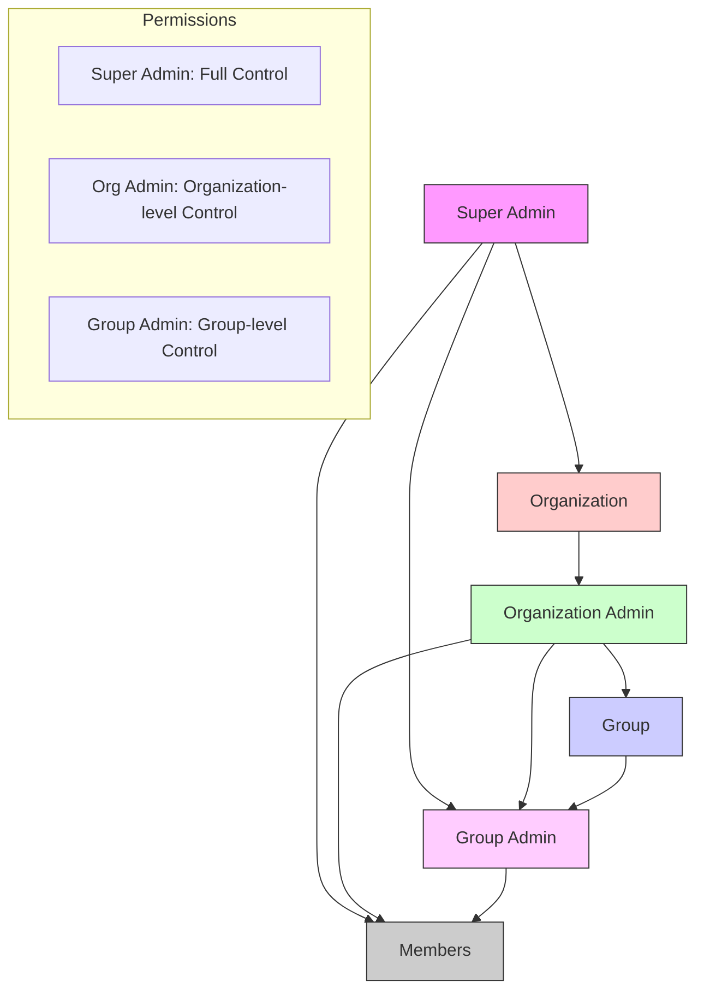
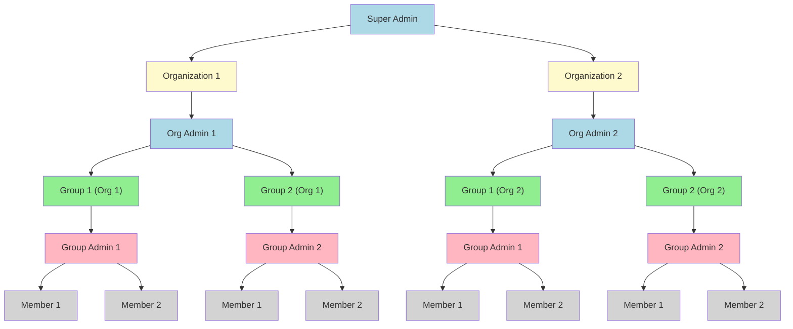

**Organization Groups**

Organization Groups, a feature designed to enhance the structure and management of users within an organization or tenant. Organization Groups allow users to be categorized into different sections, each referred to as a group.

Each group can have its own custom roles, permissions, and designated Group Admin(s). This feature introduces the concept of sub-organizations, enabling organizations to assign members to specific groups and define tailored permissions for each group, ensuring a more granular and flexible access control system.

### Functional Details

**Feature Workflow**

The IAM service provides robust functionality for creating and managing organizations or tenants. These organizations serve as central entities where users can be invited to join and participate. Once part of an organization, users are assigned specific roles and permissions, which determine their level of access to the organization's resources. These roles and permissions are integral to maintaining a secure and well-structured access control system, ensuring that users can only interact with the resources relevant to their responsibilities.

Furthermore, Organization Groups support the assignment of Group Admins, who are entrusted with the responsibility of managing the group’s members and their respective roles. This decentralization of administrative tasks empowers organizations to distribute responsibilities effectively, particularly in larger, more complex environments. By allowing distinct groups to operate independently while still adhering to the broader organization's governance, this feature provides a scalable solution for managing diverse teams and their unique needs.

### Hierarchy Flow

### Hierarchy Diagram

- **Super Admin** is at the top level.
- **Organizations** under the Super Admin, each with its own Organization Admin.
- **Groups** within each organization.
- **Group Admins** managing individual group members.
- **Group Members** at the final level, managed by Group Admins, Org Admins, and Super Admin.

### Technical Details

**Architecture**

The architecture of Organization Groups is built on a modular design, leveraging the core IAM service for user and role management. The Group Management Module acts as an extension, allowing organizations to define and manage sub-entities (groups) with their own custom roles and permissions.

**Key Components**

- **IAM Service**: Handles the creation and management of organizations, users, roles, and permissions.
- **Group Management Module**: Responsible for creating and managing Organization Groups, assigning roles, and defining group-specific permissions.
- **Group Admin Interface**: Provides tools for Group Admins to manage members and permissions within their group.
- **Database Layer**: Stores information about organizations, groups, members, roles, and permissions.
- **API Layer**: Exposes endpoints for creating and managing groups, assigning roles, and retrieving group details.

#### Data Flow

1. Group creation.
2. Setting and enforcing group-specific roles and permissions.
3. Assigning users to groups.
4. Administering group members via the Group Admin interface.

**Group Management**

**Group Admin Flow**
